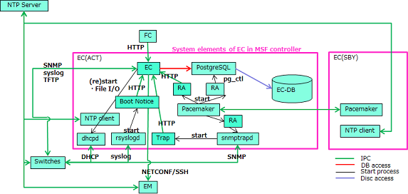

# Element Controller(EC)

Element Controller(EC) is one of the software components of Multi-Service Fabric(MSF).

EC provides the physical-logical mapping, concealment of vendor-specific information, and control interface to switch devices.

**physical-logical mapping**

EC has the physical-logical mapping table for each device. The table records the association between Logical-port and physical-IF, LAG-IF. Conversely, EC does not have the network topology information. Management of the entire network is done by Fabric Controller(FC).

## System Elements

- EC: Main process
- NTP client: Communicate with NTP server and sync clock
- Pacemaker: Middleware that controls redundancy function
- PostgreSQL: Database server
- RA: Exe by Pacemaker to control the redundancy
- dhcpd: DHCP server used to add/delete devices
- tftpd: TFTP server
- rsyslogd: Receive startup-message from devices with syslog, and start Boot Notice
- snmptrapd: Receive SNMP traps (up/down IFs, BGP peers), start "Trap"
- Trap: Transmit the information received by snmptrapd to EC
- Boot Notice: Transmit the information received by rsyslogd to EC
- FC-DB: Storage for Database

## How to use
- installation
  - [installation manual(English)](doc/Element_Controller_Installation_Manual_en.pdf) (PDF)
  - [configuration specifications(English)](doc/Element_Controller_Configuration_Specifications-en.pdf) (PDF)
  - [installation manual(Japanese)](doc/Element_Controller_Installation_Manual_ja.pdf) (PDF)
  - [configuration specifications(Japanese)](doc/Element_Controller_Configuration_Specifications-ja.pdf) (PDF)

- user guide (when using ZTP(Zero-Touch provisioning))
  - [user manual(English)](doc/Element_Controller_user-guide-for-ZTP_en.pdf) (PDF)
  - [user manual(Japanse)](doc/Element_Controller_user-guide-for-ZTP_ja.pdf) (PDF)
  - [configuration file sample](doc/ZTPsample.zip) (zip)
- Executable file `/Exe`
- source code `/EcMainModule`

## Hardware
The following conditions are the minimum operation environment.

| item | Configuraiton |
| ---- | ---- |
| OS | CentOS7.2 x86_64 |
| CPU | Intel® Xeon® CPU E5-2420 v2 @ 2.20 GHz 2 Core or more |
| memory | 1G or more |
| NIC | 1 port or more |

## License
**Apache 2.0**. See `LICENSE`.

## support
If you have any questions, or find any bug, let us know with GitHub issues, or please contact `msf-contact [at] lab.ntt.co.jp`.

## project
This project is a part of [Multi-Service Fabric](http://github.com/multi-service-fabric/).
