# Element Controller Automate Installation Manual

**Version 1.0**
**March 26, 2019**
**Copyright(c) 2019 Nippon Telegraph and Telephone Corporation**

## 1.  Introduction

1.1. Objective
---------

This document is the installation manual for the EC Main Module included
in the Element Controller (hereafter referred to as \"EC\").
Please read this manual carefully before using the software.

1.2. Scope of Application
--------------------

The scope of this document is for the operation of the components of EC
Main Module of Controller.

The subjects other than that are not covered in this document.

This manual supports both redundant and non-redundant EC systems.
The EC system is composed of the EC server and the DB server.
The EC server supports both the redundant and non-redundant configuration.
The DB server supports only the non-redundant configuration.
In this manual, you need the server (Ansible server) on which automatic install script is running in addition to the servers which consists of the EC system.

Figure 1-1 illustrates the image of each configuration.

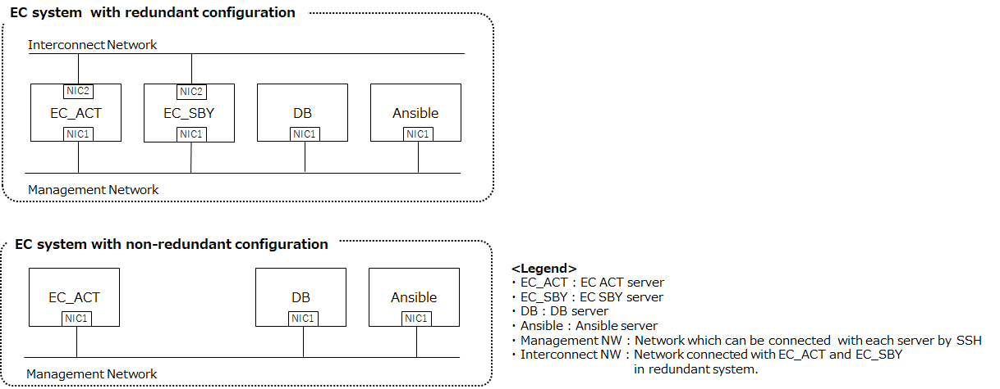 
Figure 1-1 The image of EC system configuration.

1.3. Expressional Conventions
------------------------

There are certain expressions and text styles conventionally used in
this document. Please make yourself clear about the items below before
going on through the document.

**&lt;Execution Server: XXX&gt;** - bold letters surrounded by triangle brackets

This means the server which commands are executed on.

This means ther server XXX executing commands. 
XXX is the following. 

　Ansible : Ansible server 
　ACT : EC ACT server 
　SBY : EC SBY server 
　DB  : DB server

**\[XX XX\]** - bold letters surrounded by square brackets

This means the command to be entered in Linux.

**X \[Enter\]** - bold letter and \"\[Enter\]\"

> In this case, you need to enter the letters within brackets and press
> the Enter key in the console screen.

**\$EC_HOME**

You need to replace with the same value as em_path in Table 3-1 vars Files.

1.4. Trademark Notice
----------------

All company names and product names mentioned in this document are
registered trademarks or trademarks of their respective companies.

**LinuxR:**

The registered trademark or the trademark of Linus Torvalds in the U.S.
and other countries

**PostgreSQL@:**

The trademark of PostgreSQL in the U.S. and other countries

1.5. Configuration of the Included Accessories
-----------------------------------------

The table below illustrates the required items to follow the
installation instructions in this document.

For the items described as \"in-advance DL\", you must download and
prepare them prior to implementing the installation in this document
at no internet connection.
Then, place the acquired files under the ec_main folder of the target server (created in Chapter 3)
so that they are the same as the following file structure.

However, downloading java installation package is necessary regardless of network connection.
Then, place the acquired files under the ec_main folder of the target server (created in Chapter 3)
so that they are the same as the following file structure.

Table 1-1 Included
Accessories

| \#      | Folder  | Structure |       | File    | Description | Remarks |
|---------|---------|---------|---------|---------|---------|---------|
| ec_main | \-      | \-      | \-      | \-        | \-        |
|         |         |         | jar_create.sh | Compile Script | In-Advance DL from GitHub  |
|         | msf     |         | \-      | EC source Files | In-Advance DL from GitHub   Omit details of files.   Please refer to element_controller_building_guide. |
|         | bin     |         | boot.sh | Inter-devices I/F Control Functinal Part   Device Start-up Notification Script | In-Advance DL from GitHub  |
|         |         |         | ec\_ctl.sh | EC Start-up Script | In-Advance DL from GitHub  |
|         |         |         | linkdown.sh | SNMPTrap Functional Part Link-down   Notification Script | In-Advance DL from GitHub  |
|         |         |         | linkup.sh | SNMPTrap Functional Part Link-up   Notification Script | In-Advance DL from GitHub  |
|         |         |         | controller\_status.sh | Controler Status Information Acquisition (SBY) Script | In-Advance DL from GitHub  |
|         |         |         | controller\_status\_sby.sh | Controler Status Information Acquisition Script | In-Advance DL from GitHub  |
|         |         |         | CumulusVlanTraffic.sh | User Traffic Acquisition Script (CLI) | In-Advance DL from GitHub  |
|         |         |         | check_resource_lock.sh   | Pacemaker Resource Status Monitor Script | In-Advance DL from GitHub  |
|         |         |         | resource_lock_release.sh | Pacemaker Resource Move Permission Script | In-Advance DL from GitHub  |
|         |         |         | cisco_ping.sh   | Ping Execution Script (Cisco)   | In-Advance DL from GitHub  |
|         |         |         | cumulus_ping.sh | Ping Execution Script (Cumulus) | In-Advance DL from GitHub  |
|         |         |         | juniper_ping.sh | Ping Execution Script (Juniper) | In-Advance DL from GitHub  |
|         |         |         | cisco_NCS5011.sh     | File Update Script (Cisco NCS5011)   | In-Advance DL from GitHub  |
|         |         |         | cisco_NCS5501.sh     | File Update Script (Cisco NCS5501)   | In-Advance DL from GitHub  |
|         |         |         | cumulus_AS5812.sh    | File Update Script (Cumulus)         | In-Advance DL from GitHub  |
|         |         |         | juniper_QFX5100.sh   | File Update Script (Juniper QFX5100) | In-Advance DL from GitHub  |
|         |         |         | juniper_QFX5110.sh   | File Update Script (Juniper QFX5110) | In-Advance DL from GitHub  |
|         |         |         | controller_switch.sh | Controller Switch-over Script         | In-Advance DL from GitHub  |
|         | lib     |         | NetConf.jar | NetConf Library | In-Advance DL from GitHub  |
|         |         |         | antlr-2.7.7.jar | Using Library   | In-Advance DL  |
|         |         |         | c3p0-0.9.2.1.jar | Using Library   | In-Advance DL  |
|         |         |         | commons-io-2.5.jar | Using Library   | In-Advance DL  |
|         |         |         | dom4j-1.6.1.jar | Using Library   | In-Advance DL  |
|         |         |         | ganymed-ssh2-build210.jar | Using Library   | In-Advance DL  |
|         |         |         | geronimo-jta_1.1_spec-1.1.1.jar | Using Library   | In-Advance DL  |
|         |         |         | gson-2.7.jar | Using Library   | In-Advance DL  |
|         |         |         | hibernate-c3p0-5.0.10.Final.jar | Using Library   | In-Advance DL  |
|         |         |         | hibernate-commons-annotations-5.0.1.Final.jar | Using Library   | In-Advance DL  |
|         |         |         | hibernate-core-5.0.10.Final.jar | Using Library   | In-Advance DL  |
|         |         |         | hibernate-jpa-2.1-api-1.0.0.Final.jar | Using Library   | In-Advance DL  |
|         |         |         | hk2-api-2.5.0-b05.jar | Using Library   | In-Advance DL  |
|         |         |         | hk2-locator-2.5.0-b05.jar | Using Library   | In-Advance DL  |
|         |         |         | hk2-utils-2.5.0-b05.jar | Using Library   | In-Advance DL  |
|         |         |         | javassist-3.18.1-GA.jar | Using Library   | In-Advance DL  |
|         |         |         | javax.annotation-api-1.2.jar | Using Library   | In-Advance DL  |
|         |         |         | javax.inject-2.5.0-b05.jar | Using Library   | In-Advance DL  |
|         |         |         | javax.ws.rs-api-2.0.1.jar | Using Library   | In-Advance DL  |
|         |         |         | jboss-logging-3.3.0.Final.jar | Using Library   | In-Advance DL  |
|         |         |         | jersey-client.jar | Using Library   | In-Advance DL  |
|         |         |         | jersey-common.jar | Using Library   | In-Advance DL  |
|         |         |         | jersey-container-servlet-core.jar | Using Library   | In-Advance DL  |
|         |         |         | jersey-guava-2.23.2.jar | Using Library   | In-Advance DL  |
|         |         |         | jersey-server.jar | Using Library   | In-Advance DL  |
|         |         |         | jetty-http-9.3.11.v20160721.jar | Using Library   | In-Advance DL  |
|         |         |         | jetty-io-9.3.11.v20160721.jar | Using Library   | In-Advance DL  |
|         |         |         | jetty-security-9.3.11.v20160721.jar | Using Library   | In-Advance DL  |
|         |         |         | jetty-server-9.3.11.v20160721.jar | Using Library   | In-Advance DL  |
|         |         |         | jetty-servlet-9.3.11.v20160721.jar | Using Library   | In-Advance DL  |
|         |         |         | jetty-util-9.3.11.v20160721.jar | Using Library   | In-Advance DL  |
|         |         |         | jsch-0.1.53.jar | Using Library   | In-Advance DL  |
|         |         |         | log4j-api-2.6.2.jar | Using Library   | In-Advance DL  |
|         |         |         | log4j-core-2.6.2.jar | Using Library   | In-Advance DL  |
|         |         |         | log4j-slf4j-impl-2.6.2.jar | Using Library   | In-Advance DL  |
|         |         |         | mchange-commons-java-0.2.3.4.jar | Using Library   | In-Advance DL  |
|         |         |         | org.eclipse.persistence.core.jar | Using Library   | In-Advance DL  |
|         |         |         | postgresql-9.4.1209.jre7.jar | Using Library   | In-Advance DL  |
|         |         |         | quartz-2.2.3.jar | Using Library   | In-Advance DL  |
|         |         |         | servlet-api-3.1.jar | Using Library   | In-Advance DL  |
|         |         |         | slf4j-api-1.7.21.jar | Using Library   | In-Advance DL  |
|         |         |         | slf4j-simple-1.7.21.jar | Using Library   | In-Advance DL  |
|         |         |         | snmp4j-2.5.0.jar | Using Library   | In-Advance DL  |
|         |         |         | validation-api-1.1.0.Final.jar | Using Library   | In-Advance DL  |
|         | conf    |         | ec_main.conf | EC Main Module Configuration File | In-Advance DL from GitHub  |
|         |         |         | hibernate.cfg.xml | Hibernate Configuration File | In-Advance DL from GitHub  |
|         |         |         | log4j2.xml | log4j2 Configuration File  | In-Advance DL from GitHub  |
|         |         |         | act_disk_threshold.conf   | ACT Threshold Configuration File | In-Advance DL from GitHub  |
|         |         |         | sby_disk_threshold.conf   | SBY Threshold Configuration File | In-Advance DL from GitHub  |
|         |         |         | extend_operation.conf     | Extended Function Configuration File | In-Advance DL from GitHub  |
|         |         |         | PingOspfNeighbor.conf     | Silent Failure Detection Extended Function Configuration File | In-Advance DL from GitHub  |
|         |         |         | NodeOsUpgrade.conf        | Device-File Update Extended Function Configuration File | In-Advance DL from GitHub  |
|         |         |         | ControllerFileUpdate.conf | Controller-File Update Extended Function Configuration File | In-Advance DL from GitHub  |
|         | file_update |     | db_env                   | Environment Configuration File | In-Advance DL from GitHub |
|         |         |         | db_schema_update.sh      | DB Schema Update Script        | In-Advance DL from GitHub |
|         |         |         | MSF2017_MSF2018B.sh      | Script for Update DB Schema from MSF2017 to MSF2018B        | In-Advance DL from GitHub |
|         |         |         | MSF2017_to_MSF2018B.sql  | DB Schema Update SQL (MSF2017 to MSF2018B)        | In-Advance DL from GitHub |
|         |         |         | MSF2018A_MSF2018B.sh     | Script for Update DB Schema from MSF2018A to MSF2018B        | In-Advance DL from GitHub |
|         |         |         | MSF2018A_to_MSF2018B.sql | DB Schema Update SQL (MSF2018A to MSF2018B)          | In-Advance DL from GitHub |
|         |         |         | db_backup.sh             | DB Backup Script               | In-Advance DL from GitHub |
|         |         |         | db_restore.sh            | DB Restore Script              | In-Advance DL from GitHub |
|         |         |         | Convert_fc_lag_id.sh     | LAG IF ID Conversion Script    | In-Advance DL from GitHub |
|         |         |         | data.csv                 | LAG IF ID Conversion Data File | In-Advance DL from GitHub |
|         |         |         | fc_lag_if_id_update.sql  | LAG IF ID Conversion SQL       | In-Advance DL from GitHub |
|         |         |         | node_id_convert.sql      | Node ID Conversion SQL         | In-Advance DL from GitHub |
|         |         |         | ec_fileUpgrade.sh        | Binary Update Script        | In-Advance DL from GitHub |
|         |         |         | file_oldparam_env        | Parameter Definition File taken-over from Binary File | In-Advance DL from GitHub |
|         | Installer |       |                                     |     |   |
|         |  | dhcp.v4.2.5    | dhcp-4.2.5-42.el7.centos.x86_64.rpm | DHCP Installation Package    | In-Advance DL  |
|         |  | chrony.v3.2    | chrony-3.2-2.el7.x86_64.rpm         | chrony Installation Package     | In-Advance DL  |
|         |         |         | libseccomp-2.3.1-3.el7.x86_64.rpm   | chrony Installation Package     | In-Advance DL  |
|         | | postgresql.v9.3.13 | postgresql93-9.3.13-1PGDG.rhel7.x86_64.rpm | PostgreSQL Installation Package | In-Advance DL  |
|         |         |         | postgresql93-contrib-9.3.13-1PGDG.rhel7.x86_64.rpm | PostgreSQL Installation Package | In-Advance DL  |
|         |         |         | postgresql93-devel-9.3.13-1PGDG.rhel7.x86_64.rpm | PostgreSQL Installation Package | In-Advance DL  |
|         |         |         | postgresql93-libs-9.3.13-1PGDG.rhel7.x86_64.rpm | PostgreSQL Installation Package | In-Advance DL  |
|         |         |         | postgresql93-server-9.3.13-1PGDG.rhel7.x86_64.rpm | PostgreSQL Installation Package | In-Advance DL  |
|         |         |         | uuid-1.6.2-26.el7.x86_64.rpm | PostgreSQL Installation Package | In-Advance DL  |
|         |         |         | libxslt-1.1.28-5.el7.x86_64.rpm | PostgreSQL Installation Package | In-Advance DL  |
|         | | snmptrapd.v5.7.2 | perl-HTTP-Tiny-0.033-3.el7.noarch.rpm | Net-SNMP Installation Package | In-Advance DL  |
|         |         |         | perl-Pod-Perldoc-3.20-4.el7.noarch.rpm | Net-SNMP Installation Package | In-Advance DL  |
|         |         |         | perl-podlators-2.5.1-3.el7.noarch.rpm | Net-SNMP Installation Package | In-Advance DL  |
|         |         |         | perl-Encode-2.51-7.el7.x86_64.rpm | Net-SNMP Installation Package | In-Advance DL  |
|         |         |         | perl-Text-ParseWords-3.29-4.el7.noarch.rpm | Net-SNMP Installation Package | In-Advance DL  |
|         |         |         | perl-Pod-Usage-1.63-3.el7.noarch.rpm | Net-SNMP Installation Package | In-Advance DL  |
|         |         |         | perl-constant-1.27-2.el7.noarch.rpm | Net-SNMP Installation Package | In-Advance DL  |
|         |         |         | perl-Time-Local-1.2300-2.el7.noarch.rpm | Net-SNMP Installation Package | In-Advance DL  |
|         |         |         | perl-Storable-2.45-3.el7.x86_64.rpm | Net-SNMP Installation Package | In-Advance DL  |
|         |         |         | perl-Socket-2.010-3.el7.x86_64.rpm | Net-SNMP Installation Package | In-Advance DL  |
|         |         |         | perl-Scalar-List-Utils-1.27-248.el7.x86_64.rpm | Net-SNMP Installation Package | In-Advance DL  |
|         |         |         | perl-File-Temp-0.23.01-3.el7.noarch.rpm | Net-SNMP Installation Package | In-Advance DL  |
|         |         |         | perl-Getopt-Long-2.40-2.el7.noarch.rpm | Net-SNMP Installation Package | In-Advance DL  |
|         |         |         | perl-File-Path-2.09-2.el7.noarch.rpm | Net-SNMP Installation Package | In-Advance DL  |
|         |         |         | perl-Exporter-5.68-3.el7.noarch.rpm | Net-SNMP Installation Package | In-Advance DL  |
|         |         |         | perl-Carp-1.26-244.el7.noarch.rpm | Net-SNMP Installation Package | In-Advance DL  |
|         |         |         | perl-PathTools-3.40-5.el7.x86_64.rpm | Net-SNMP Installation Package | In-Advance DL  |
|         |         |         | perl-Pod-Escapes-1.04-286.el7.noarch.rpm | Net-SNMP Installation Package | In-Advance DL  |
|         |         |         | perl-macros-5.16.3-286.el7.x86_64.rpm | Net-SNMP Installation Package | In-Advance DL  |
|         |         |         | perl-threads-shared-1.43-6.el7.x86_64.rpm | Net-SNMP Installation Package | In-Advance DL  |
|         |         |         | perl-threads-1.87-4.el7.x86_64.rpm | Net-SNMP Installation Package | In-Advance DL  |
|         |         |         | perl-Time-HiRes-1.9725-3.el7.x86_64.rpm | Net-SNMP Installation Package | In-Advance DL  |
|         |         |         | perl-Pod-Simple-3.28-4.el7.noarch.rpm | Net-SNMP Installation Package | In-Advance DL  |
|         |         |         | perl-Filter-1.49-3.el7.x86_64.rpm | Net-SNMP Installation Package | In-Advance DL  |
|         |         |         | perl-parent-0.225-244.el7.noarch.rpm | Net-SNMP Installation Package | In-Advance DL  |
|         |         |         | net-snmp-agent-libs-5.7.2-24.el7_2.1.x86_64.rpm | Net-SNMP Installation Package | In-Advance DL  |
|         |         |         | net-snmp-libs-5.7.2-24.el7_2.1.x86_64.rpm | Net-SNMP Installation Package | In-Advance DL  |
|         |         |         | perl-5.16.3-286.el7.x86_64.rpm | Net-SNMP Installation Package | In-Advance DL  |
|         |         |         | perl-libs-5.16.3-286.el7.x86_64.rpm | Net-SNMP Installation Package | In-Advance DL  |
|         |         |         | perl-Data-Dumper-2.145-3.el7.x86_64.rpm | Net-SNMP Installation Package | In-Advance DL  |
|         |         |         | net-snmp-5.7.2-24.el7_2.1.x86_64.rpm | Net-SNMP Installation Package | In-Advance DL  |
|         |         |         | openssl098e-0.9.8e-29.el7.centos.3.x86_64.rpm | Net-SNMP Installation Package | In-Advance DL  |
|         |         |         | glibc-2.17-105.el7.x86_64.rpm | Net-SNMP Installation Package | In-Advance DL  |
|         |         |         | glibc-common-2.17-105.el7.x86_64.rpm | Net-SNMP Installation Package | In-Advance DL  |
|         |         |         | lm_sensors-libs-3.3.4-11.el7.x86_64.rpm | Net-SNMP Installation Package | In-Advance DL  |
|         | | java.v8u92      | jdk-8u92-linux-x64.rpm | Java Installation Package    | In-Advance DL  |
|         | | pacemaker.v1.1.14-1.1 | pacemaker-1.1.14-1.el7.x86_64.rpm | Pacemaker Installation Package | In-Advance DL  |
|         |         |         | corosync-2.3.5-1.el7.x86_64.rpm | Corosync  Installation Package | In-Advance DL  |
|         |         |         | crmsh-2.1.5-1.el7.x86_64.rpm | Crm Command Installation Package     | In-Advance DL  |
|         |         |         | cluster-glue-1.0.12-2.el7.x86_64.rpm | Pacemaker Dependent Package | In-Advance DL  |
|         |         |         | cluster-glue-libs-1.0.12-2.el7.x86_64.rpm | Pacemaker Dependent Package | In-Advance DL  |
|         |         |         | corosynclib-2.3.5-1.el7.x86_64.rpm | Corosync Dependent Package | In-Advance DL  |
|         |         |         | ipmitool-1.8.13-9.el7_2.x86_64.rpm | Pacemaker Dependent Package | In-Advance DL  |
|         |         |         | libqb-1.0-1.el7.x86_64.rpm | Pacemaker Dependent Package | In-Advance DL  |
|         |         |         | libtool-ltdl-2.4.2-21.el7_2.x86_64.rpm | Pacemaker Dependent Package | In-Advance DL  |
|         |         |         | libxslt-1.1.28-5.el7.x86_64.rpm | Pacemaker Dependent Package | In-Advance DL  |
|         |         |         | libyaml-0.1.4-11.el7_0.x86_64.rpm | Pacemaker Dependent Package | In-Advance DL  |
|         |         |         | lm_sensors-libs-3.3.4-11.el7.x86_64.rpm | Pacemaker Dependent Package | In-Advance DL  |
|         |         |         | nano-2.3.1-10.el7.x86_64.rpm | crm Dependent Package | In-Advance DL  |
|         |         |         | net-snmp-agent-libs-5.7.2-24.el7_2.1.x86_64.rpm | Corosync Dependent Package | In-Advance DL  |
|         |         |         | net-snmp-libs-5.7.2-24.el7_2.1.x86_64.rpm | Corosync Dependent Package | In-Advance DL  |
|         |         |         | openhpi-libs-3.4.0-2.el7.x86_64.rpm | Pacemaker Dependent Package | In-Advance DL  |
|         |         |         | OpenIPMI-libs-2.0.19-11.el7.x86_64.rpm | Pacemaker Dependent Package | In-Advance DL  |
|         |         |         | OpenIPMI-modalias-2.0.19-11.el7.x86_64.rpm | Pacemaker Dependent Package | In-Advance DL  |
|         |         |         | pacemaker-cli-1.1.14-1.el7.x86_64.rpm | Pacemaker Dependent Package | In-Advance DL  |
|         |         |         | pacemaker-cluster-libs-1.1.14-1.el7.x86_64.rpm | Pacemaker Dependent Package | In-Advance DL  |
|         |         |         | pacemaker-libs-1.1.14-1.el7.x86_64.rpm | Pacemaker Dependent Package | In-Advance DL  |
|         |         |         | pacemaker-all-1.1.14-1.1.el7.noarch.rpm | Pacemaker Dependent Package | In-Advance DL  |
|         |         |         | perl-5.16.3-286.el7.x86_64.rpm | Pacemaker Dependent Package | In-Advance DL  |
|         |         |         | perl-Carp-1.26-244.el7.noarch.rpm | Pacemaker Dependent Package | In-Advance DL  |
|         |         |         | perl-constant-1.27-2.el7.noarch.rpm | Pacemaker Dependent Package | In-Advance DL  |
|         |         |         | perl-Encode-2.51-7.el7.x86_64.rpm | Pacemaker Dependent Package | In-Advance DL  |
|         |         |         | perl-Exporter-5.68-3.el7.noarch.rpm | Pacemaker Dependent Package | In-Advance DL  |
|         |         |         | perl-File-Path-2.09-2.el7.noarch.rpm | Pacemaker Dependent Package | In-Advance DL  |
|         |         |         | perl-File-Temp-0.23.01-3.el7.noarch.rpm | Pacemaker Dependent Package | In-Advance DL  |
|         |         |         | perl-Filter-1.49-3.el7.x86_64.rpm | Pacemaker Dependent Package | In-Advance DL  |
|         |         |         | perl-Getopt-Long-2.40-2.el7.noarch.rpm | Pacemaker Dependent Package | In-Advance DL  |
|         |         |         | perl-HTTP-Tiny-0.033-3.el7.noarch.rpm | Pacemaker Dependent Package | In-Advance DL  |
|         |         |         | perl-libs-5.16.3-286.el7.x86_64.rpm | Pacemaker Dependent Package | In-Advance DL  |
|         |         |         | perl-macros-5.16.3-286.el7.x86_64.rpm | Pacemaker Dependent Package | In-Advance DL  |
|         |         |         | perl-parent-0.225-244.el7.noarch.rpm | Pacemaker Dependent Package | In-Advance DL  |
|         |         |         | perl-PathTools-3.40-5.el7.x86_64.rpm | Pacemaker Dependent Package | In-Advance DL  |
|         |         |         | perl-Pod-Escapes-1.04-286.el7.noarch.rpm | Pacemaker Dependent Package | In-Advance DL  |
|         |         |         | perl-podlators-2.5.1-3.el7.noarch.rpm | Pacemaker Dependent Package | In-Advance DL  |
|         |         |         | perl-Pod-Perldoc-3.20-4.el7.noarch.rpm | Pacemaker Dependent Package | In-Advance DL  |
|         |         |         | perl-Pod-Simple-3.28-4.el7.noarch.rpm | Pacemaker Dependent Package | In-Advance DL  |
|         |         |         | perl-Pod-Usage-1.63-3.el7.noarch.rpm | Pacemaker Dependent Package | In-Advance DL  |
|         |         |         | perl-Scalar-List-Utils-1.27-248.el7.x86_64.rpm | Pacemaker Dependent Package | In-Advance DL  |
|         |         |         | perl-Socket-2.010-3.el7.x86_64.rpm | Pacemaker Dependent Package | In-Advance DL  |
|         |         |         | perl-Storable-2.45-3.el7.x86_64.rpm | Pacemaker Dependent Package | In-Advance DL  |
|         |         |         | perl-Text-ParseWords-3.29-4.el7.noarch.rpm | Pacemaker Dependent Package | In-Advance DL  |
|         |         |         | perl-threads-1.87-4.el7.x86_64.rpm | Pacemaker Dependent Package | In-Advance DL  |
|         |         |         | perl-threads-shared-1.43-6.el7.x86_64.rpm | Pacemaker Dependent Package | In-Advance DL  |
|         |         |         | perl-TimeDate-2.30-2.el7.noarch.rpm | Pacemaker Dependent Package | In-Advance DL  |
|         |         |         | perl-Time-HiRes-1.9725-3.el7.x86_64.rpm | Pacemaker Dependent Package | In-Advance DL  |
|         |         |         | perl-Time-Local-1.2300-2.el7.noarch.rpm | Pacemaker Dependent Package | In-Advance DL  |
|         |         |         | pm_crmgen-2.1-1.el7.noarch.rpm | Pacemaker Dependent Package | In-Advance DL  |
|         |         |         | pm_diskd-2.2-1.el7.x86_64.rpm | Diskd RA Package   | In-Advance DL  |
|         |         |         | pm_extras-2.2-1.el7.x86_64.rpm | VIPCheck RA Packge | In-Advance DL  |
|         |         |         | pm_logconv-cs-2.2-1.el7.noarch.rpm | Pacemaker Dependent Package | In-Advance DL  |
|         |         |         | psmisc-22.20-9.el7.x86_64.rpm | Pacemaker Dependent Package | In-Advance DL  |
|         |         |         | pssh-2.3.1-5.el7.noarch.rpm | crm Dependent Package     | In-Advance DL  |
|         |         |         | resource-agents-3.9.7-1.2.6f56.el7.x86_64.rpm | Standard RA Package Including Virtual IPRA | In-Advance DL  |
|         |         |         | python-clufter-0.50.4-1.el7.x86_64.rpm | pcs Dependent Package | In-Advance DL  |
|         |         |         | python-dateutil-1.5-7.el7.noarch.rpm | pcs Dependent Package | In-Advance DL  |
|         |         |         | python-lxml-3.2.1-4.el7.x86_64.rpm | pcs Dependent Package | In-Advance DL  |
|         |         |         | resource-agents-3.9.7-1.2.6f56.el7.x86_64.rpm | Standard RA Package Including Virtual IPRA | In-Advance DL  |
|         |         |         | ruby-irb-2.0.0.598-25.el7_1.noarch.rpm | pcs Dependent Package | In-Advance DL  |
|         |         |         | ruby-libs-2.0.0.598-25.el7_1.x86_64.rpm | pcs Dependent Package | In-Advance DL  |
|         |         |         | rubygem-bigdecimal-1.2.0-25.el7_1.x86_64.rpm | pcs Dependent Package | In-Advance DL  |
|         |         |         | rubygem-io-console-0.4.2-25.el7_1.x86_64.rpm | pcs Dependent Package | In-Advance DL  |
|         |         |         | rubygem-json-1.7.7-25.el7_1.x86_64.rpm | pcs Dependent Package | In-Advance DL  |
|         |         |         | rubygem-psych-2.0.0-25.el7_1.x86_64.rpm | pcs Dependent Package | In-Advance DL  |
|         |         |         | rubygem-rdoc-4.0.0-25.el7_1.noarch.rpm | pcs Dependent Package | In-Advance DL  |
|         |         |         | rubygems-2.0.14-25.el7_1.noarch.rpm | pcs Dependent Package | In-Advance DL  |
|         | | httpd.v2.4.6    | apr-1.4.8-3.el7.x86_64.rpm | httpd Installation Package | In-Advance DL  |
|         |         |         | apr-util-1.5.2-6.el7.x86_64.rpm | httpd Installation Package | In-Advance DL  |
|         |         |         | mailcap-2.1.41-2.el7.noarch.rpm | httpd Installation Package | In-Advance DL  |
|         |         |         | httpd-tools-2.4.6-40.el7.centos.4.x86_64.rpm | httpd Installation Package | In-Advance DL  |
|         |         |         | httpd-2.4.6-40.el7.centos.4.x86_64.rpm | httpd Installation Package | In-Advance DL  |
|         |         |         | httpd-manual-2.4.6-40.el7.centos.4.noarch.rpm | httpd Installation Package | In-Advance DL  |
|         |         |         | mod_ssl-2.4.6-40.el7.centos.4.x86_64.rpm | httpd Installation Package | In-Advance DL  |
|         | | sysstat-11.6.0-1 | sysstat-11.6.0-1.x86_64.rpm | Sysstat Installation Package | In-Advance DL  |
|         | | tftp.v5.2       | xinetd-2.3.15-12.el7.x86_64.rpm | tftpd Installation Package   | In-Advance DL  |
|         |         |         | tftp-5.2-12.el7.x86_64.rpm | tftpd Installation Package   | In-Advance DL  |
|         |         |         | tftp-server-5.2-12.el7.x86_64.rpm | tftpd Installation Package   | In-Advance DL  |
|         | | expect-5.45-14  | expect-5.45-14.el7_1.x86_64.rpm | expect Installation Package   | In-Advance DL  |
|         |         |         | tcl-8.5.13-8.el7.x86_64.rpm | tcl Installation Package   | In-Advance DL  |
|         | | bc-1.06.95-13   | bc-1.06.95-13.el7.x86_64.rpm | bc Installation Package   | In-Advance DL  |
|         | database |         | \-      | \-      | \-      |
|         |         |         | create_table.sql | Table Creation Script   | In-Advance DL from GitHub  |
|         |         |         | delete_data.sql  | DB Record Deletion Script | In-Advance DL from GitHub  |
|         |         |         | drop_table.sql   | Table Deletion Script   | In-Advance DL from GitHub  |
|         | RA      |         | \-      | \-      | \-      |
|         |         |         | pm_crmgen_env.xls | Resource Agent Configuration File | In-Advance DL  |
|         |         |         | ec      | Resource Agent | In-Advance DL from GitHub  |
|         |         |         | snmptrapd | Resource Agent | In-Advance DL from GitHub  |
| Ansible |         |         |           |               |         |
|         |         |         | ansible-2.4.2.0-2.el7.noarch.rpm | Ansible Installation Package   | In-Advance DL  |
|         |         |         | PyYAML-3.10-11.el7.x86_64.rpm | Ansible Dependent Package   | In-Advance DL  |
|         |         |         | libyaml-0.1.4-11.el7_0.x86_64.rpm | Ansible Dependent Package   | In-Advance DL  |
|         |         |         | openssl-1.0.2k-8.el7.x86_64.rpm | Ansible Dependent Package   | In-Advance DL  |
|         |         |         | openssl-libs-1.0.2k-8.el7.x86_64.rpm | Ansible Dependent Package   | In-Advance DL  |
|         |         |         | python-babel-0.9.6-8.el7.noarch.rpm | Ansible Dependent Package   | In-Advance DL  |
|         |         |         | python-backports-1.0-8.el7.x86_64.rpm | Ansible Dependent Package   | In-Advance DL  |
|         |         |         | python-backports-ssl_match_hostname-3.4.0.2-4.el7.noarch.rpm | Ansible Dependent Package   | In-Advance DL  |
|         |         |         | python-cffi-1.6.0-5.el7.x86_64.rpm | Ansible Dependent Package   | In-Advance DL  |
|         |         |         | python-enum34-1.0.4-1.el7.noarch.rpm | Ansible Dependent Package   | In-Advance DL  |
|         |         |         | python-httplib2-0.9.2-1.el7.noarch.rpm | Ansible Dependent Package   | In-Advance DL  |
|         |         |         | python-idna-2.4-1.el7.noarch.rpm | Ansible Dependent Package   | In-Advance DL  |
|         |         |         | python-ipaddress-1.0.16-2.el7.noarch.rpm | Ansible Dependent Package   | In-Advance DL  |
|         |         |         | python-jinja2-2.7.2-2.el7.noarch.rpm | Ansible Dependent Package   | In-Advance DL  |
|         |         |         | python-markupsafe-0.11-10.el7.x86_64.rpm | Ansible Dependent Package   | In-Advance DL  |
|         |         |         | python-paramiko-2.1.1-2.el7.noarch.rpm | Ansible Dependent Package   | In-Advance DL  |
|         |         |         | python-passlib-1.6.5-2.el7.noarch.rpm | Ansible Dependent Package   | In-Advance DL  |
|         |         |         | python-ply-3.4-11.el7.noarch.rpm | Ansible Dependent Package   | In-Advance DL  |
|         |         |         | python-python-pycparser-2.14-1.el7.noarch.rpm | Ansible Dependent Package   | In-Advance DL  |
|         |         |         | python-setuptools-0.9.8-7.el7.noarch.rpm | Ansible Dependent Package   | In-Advance DL  |
|         |         |         | python-six-1.9.0-2.el7.noarch.rpm | Ansible Dependent Package   | In-Advance DL  |
|         |         |         | python2-cryptography-1.7.2-1.el7.x86_64.rpm | Ansible Dependent Package   | In-Advance DL  |
|         |         |         | python2-jmespath-0.9.0-3.el7.noarch.rpm | Ansible Dependent Package   | In-Advance DL  |
|         |         |         | python2-pyasn1-0.1.9-7.el7.noarch.rpm | Ansible Dependent Package   | In-Advance DL  |
|         |         |         | sshpass-1.06-2.el7.x86_64.rpm | Ansible Dependent Package   | In-Advance DL  |

## 2. Operational Environment

2.1. EC Main Module Start-up Server of Controller
------------------------------------------------

### 2.1.1. Hardware Operating environment

It is recommended to operate the software on the following Linux
computer environment.

Table 2-1 Recommended Hardware Configuration

| No.  | Computer      | Minimum Configuration                |
|------|---------------|--------------------------------------|
| 1.   | OS            | CentOS7.2 x86\_64  \*                |
| 2.   | CPU           | IntelR XeonR CPU E5-2420 v2 @2.20GHz   6 Core/12 Thread or greater |
| 3.   | Memory        | 32GB or larger                       |
| 4.   | HD Free Space | 500G or larger                       |
| 5.   | NIC           | More than 1 port                     |

\* : You need to install it from CentOS-7-x86_64-DVD-1511.iso file.

### 2.1.2. Software Operating environment
Assume that firewalld has already been installed as a package.
If you install this application by the internet using a proxy server, 
you need to confirm that target servers are able to accsess the internet by https and http protcol.
Also assume that wget has already been installed as a package.

## 3. Installation of Controller Server

The instructions described in this section must be performed by the root
user unless any specific user is specified.

**&lt;Execution Host: Ansible&gt;**

Create a working folder where the files generated in the process of
installation are located.

(It will be deleted when the installation of Controller Server is
completed.)

**\[mkdir \~/setup\] \[Enter\]**

In case of non-connected Internet environment,
locate the ec\_main folder which is configured as described in \"1.5
Configuration of the Included Accessories \" above in the working
folder. (The Ansible folder is unnecessary.) 
Even in case of connected Internet environment,
you need to download the necessary files in installing java.
And then, place it under the work folder along the path shown in
\"1.5 Configuration of the Included Accessories \". 
Specifically, place the following file manually. 
 
/root/setup/ec_main/installer/java.v8u92/jdk-8u92-linux-x64.rpm

3.1. Ansible Installation
--------------------------

**&lt;Execution Host: Ansible&gt;**

Before Installation, place the rpm files in Ansible installation destination server.
The placement targets are the files under the Anslbile folder described in \"1.5 Configuration of the Included Accessories \". 
(Locations: /root/setup/Ansible)

Execute the following command to install Ansible.

**\[cd /root/setup/Ansible\] \[Enter\]**

**\[rpm -Uvh \*rpm\] \[Enter\]**

3.2. Controller Server Installation
--------------------------

### 3.2.1. Prepare Installation

### 3.2.1.1. Deploy SSH key

**&lt;Execution Host: Ansible&gt;**

Generate the SSH authentication key with the following command.

**\[ssh -keygen -t rsa\] \[Enter\]**

After that, copy the generated key to the target servers.

**\[scp \~/.ssh/id_rsa.pub root@$REMOTE_IP:\~\] \[Enter\]**

($REMOTE_IP: IP of the install target server (EC Main Module or DB))

**&lt;Execution Host: ACT/SBY&gt;**

Execute the following command on each server.

Check whether the directory for locating SSH key is available or not. 

**\[ls /root/.ssh/\] \[Enter\]**

If it is not available, login to the host(your server) to be executed by using SSH to create the directory for locating SSH key.

**\[ssh root@localhost\] \[Enter\]**

Locate the SSH key in the designated place.

**\[cd /root/.ssh/\] \[Enter\]**

**\[touch authorized_keys\] \[Enter\]**

**\[chmod 600 authorized_keys\] \[Enter\]**

**\[cat ~/id_rsa.pub >> authorized_keys\] \[Enter\]**

**\[rm ~/id_rsa.pub\] \[Enter\]**

### 3.2.1.2. Deploy Instllation Files

**&lt;Execution Host: Ansible&gt;**

Before Installation, place the playbook file in Ansible installation destination server. 
A set of Playbooks can be download at the URL below.

> Download URL : https://github.com/multi-service-fabric/element-controller/tree/master/playbook  

(Locations: /root/setup/playbook/) 
If you do not use the Internet connection, place rpm files for install.
However, you need to manually DL java rpm file and place it, even if you have an Internet connection.

#### 3.2.1.3. Edit playbook
Write the IP information of EC and DB to the host file (/root/setup/playbook/EC/hosts) which use by playbook.
Also, put the yml files which has environmental information for each server to the vars folder (/root/setup/playbook/EC/vars/).

##### 3.2.1.3.1. Edit host file
Figure 3-1 shows the configuration example for file : /root/setup/playbook/EC/hosts.

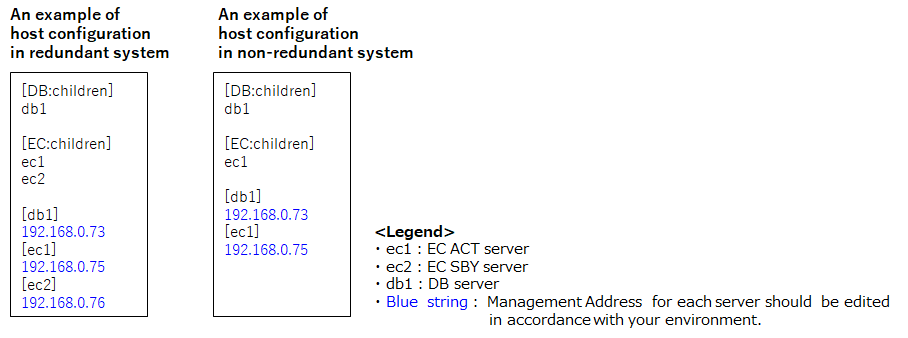 
Figure 3-1 An example of hosts configuration.

##### 3.2.1.3.2. Deploy vars file
The follwing are the files located within /root/setup/playbook/EC/vars/. 
 Table 3-1 lists the setting values for configuration

On the variables of which the recommened value are decribed in column “description”,
You can set the recommended values, if you do not need to set any specific values.

EC ACT server configuration file：ec1.yml(See column“EC”in table 3-1) 
EC SBY server configuration file：ec2.yml(See column“EC in table 3-1) 
DB server configuration file：db1.yml(See column“DB in table 3-1) 
Common configuration file：common.yml(See column“Common in table 3-1)

Table 3-1 vars Parameter

| name                | Description                                                                                                                                                                                                             | EC | DB | Common |
|---------------------|-------------------------------------------------------------------------------------------------------------------------------------------------------------------------------------------------------------------------|----|----|--------|
| rpm_path            | In the case of using network connection, the path of installing file location.   In the case of no network connection, it is installing files path in the Ansible server.   (Recommendation: /root/setup/ec_main) | × | × |   ○   |
| ec_path             | The path of EC location.   (Recommendation: /usr/ec_main).                                                                                                                                                           | ○ | × |   ×   |
| download_flag       | Parameter for determining whether to acquire a file from the Internet or place it on an Ansible server.   If True, use the Internet connection.                                                                      | ○ | ○ |   ×   |
| installing_ec_path  | The path of EC source folder location in Ansible Server.   (Recommendation: /root/setup/ec_main)                                                                                                                     | ○ | × |   ×   |
| log_path            | Relative path of EC log file output destination.   (Recommendation: logs/ec/log)                                                                                                                                     | ○ | × |   ×   |
| ec_jar_name         | The name of EC jar file.   (Recommendation: EcMainModule.jar)                                                                                                                                                        | ○ | × |   ×   |
| db_address          | DB server IP address.                                                                                                                                                                                                   | ○ | ○ |   ×   |
| db_name             | DB name. (Recommendation: msf_ec_1)                                                                                                                                                                                     | ○ | ○ |   ×   |
| ec_physical_address | EC physical IP address.                                                                                                                                                                                                 | ○ | × |   ×   |
| ec_listening_address| EC REST IP address.  It is also used for dhcp, tftp, http when the devices are added in the system.                                                                                                                  | ○ | × |   ×   |
| ec_rest_port        | EC REST port. (Recommendation: 18080)                                                                                                                                                                                   | ○ | × |   ×   |
| em_netconf_address  | EM netconf IP address.                                                                                                                                                                                                  | ○ | × |   ×   |
| em_netconf_port     | EM netconf port. (Recommendation: 831)                                                                                                                                                                                  | ○ | × |   ×   |
| em_rest_address     | EM REST IP address.                                                                                                                                                                                                     | ○ | × |   ×   |
| em_rest_port        | EM REST port. (Recommendation: 8080)                                                                                                                                                                                    | ○ | × |   ×   |
| fc_rest_address     | FC REST IP address.                                                                                                                                                                                                     | ○ | × |   ×   |
| fc_rest_port        | FC REST port.                                                                                                                                                                                                           | ○ | × |   ×   |
| device_cidr         | The network address of the device that allows reception by Rsyslog. (CIDR)                                                                                                                                              | ○ | × |   ×   |
| dhcp_if_name        | The IF name (device name) of EC to be used when starting Dhcp server.                                                                                                                                                   | ○ | × |   ×   |
| controller_cidr     | The network name of the server that the DB allows for connections. (CIDR)                                                                                                                                               | ○ | ○ |   ×   |
| ntp_server_address  | NTP server address.                                                                                                                                                                                                     | ○ | × |   ×   |
| ha_flag             | Flag indicating whether to implement redundancy. In the case of truth it is implemented.                                                                                                                                | ○ | × |   ×   |
| act_address         | Inter connect IP address for act server. (When ha_flag is False, it is set to none)                                                                                                                                     | ○ | ○ |   ×   |
| act_node_name       | Name for act server. (When ha_flag is False, it is set to none)                                                                                                                                                         | ○ | ○ |   ×   |
| sby_address         | Inter connect IP address for stand-by server. (When ha_flag is False, it is set to none)                                                                                                                                | ○ | ○ |   ×   |
| sby_node_name       | Name for stand-by server. (When ha_flag is False, it is set to none)                                                                                                                                                    | ○ | ○ |   ×   |
| cluster_name        | Cluster name (When ha_flag is False, it is set to none)   (Recommendation: ec_cluster)                                                                                                                               | ○ | ○ |   ×   |
| oppo_login_address  | Log-in address of opposite controller. (When ha_flag is False, it is set to none)                                                                                                                                       | ○ | × |   ×   |
| oppo_usrname        | Log-in user name of opposite controller. (When ha_flag is False, it is set to none)                                                                                                                                     | ○ | × |   ×   |
| oppo_password       | Log-in password of opposite controller. (When ha_flag is False, it is set to none)                                                                                                                                      | ○ | × |   ×   |
| install_flag        | When setting the DB, it decides whether to install PostgreSQL.   In case of True, execute installation.                                                                                                              | × | ○ |   ×   |

#### 3.2.1.4. Delete existing DB
If the same name DB (db_name specified in the vars file) already exists in the installation DB server, it is necessary to delete it beforehand.

**&lt;Execution Host: DB&gt;**

Execute the following command and delete DB with postgres user.

**\[su - postgres\] \[Enter\]**

**\[dropdb \[DB name\]\] \[Enter\]**

### 3.2.2. Execute Installation
**&lt;Execution Host: Ansible&gt;**

Execute the following command to install this application.

**\[cd /root/setup/playbook/EC] \[Enter\]**

**\[ansible-playbook ec.yml -i hosts\] \[Enter\]**

### 3.2.3. Edit Configuration

#### 3.2.3.1. Edit of EC configure file
The settings required for the operation (IP,port,file path etc...) are automatically replaced with the parameters at the time of installation.
If you want to change other setting, you need to fix it by hand.

Change the EC Main Module configuration file by use of the following command.

**\[vi $EC_HOME/ec_main/conf/ec_main.conf\] \[Enter\]**

Please refer to "element\_controller\_configuration\_specifications.md" for the details of the change.

extend\_operation.conf is necessary in system operation, however there is no need to edit it.

#### 3.2.3.2. Making of crm File

**&lt;Execution Host: ACT&gt;**

Edit the pm\_crmgen\_env.xls file(*1), which has the configuration of resource
agent in the included accessories, for updating the necessary
information, then convert it to a csv file and locate in the home folder
of the active system.

Execute the following command at the folder where you locate the csv
file to convert it into a crm file that is used for registering it to
the resource agent.

**\[pm\_crmgen -o \$EC\_HOME/conf/crm\_conf.crm (located csv file name).csv\] \[Enter\]**

If the conversion completes successfully, nothing will be displayed in
the screen but in case anything went wrong with the csv file, the
location to be amended would be displayed.

*1. Make sure to acquire the file “pm_crmgen_env.xls” from the following URL. 
URL : https://github.com/linux-ha-japan/pm_crmgen-1.0/blob/master/pm_crmgen_env.xls  
See sheet : pm_crmgen_environment definition(1.1)

In addition, please follow the procedures shown below (Figure 3-2 Cluster property to Figure 3-12 Resource activation order restriction.)  when editing the file “pm_crmgen_env.xls”. 
Moreover, add new lines to the original file when required. 

Since the following values in the figure are examples, you need to change the value.
You should replace the following bold text with the values in Table 3-1 vars Parameter.

EC_CONTROL_SHELL (Figure 3-5) : __ec_path__/bin/ec_ctl.sh (absolute path) 
device (Figure 3-6) : Target physical volumes of disk check 
target_ip (Figure 3-7) : The same value as __ec_listening_address__. 
ip (Figure 3-8) : The same value as __ec_listening_address__. 
nic (Figure 3-8) : Name of the NIC to which the virtual IP address is assigned. 
cidr_netmask (Figure 3-8) : The same value as __controller_cidr__. 
Value of line which score is 200.(Figure 3-10) : The same value as __act_node_name__. 
Value of line which score is 100.(Figure 3-10) : The same value as __sby_node_name__. 

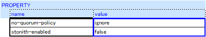 
Figure 3-2 Cluster property

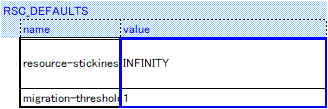 
Figure 3-3 Resource default

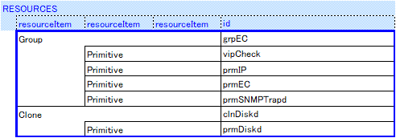 
Figure 3-4 Resource structure

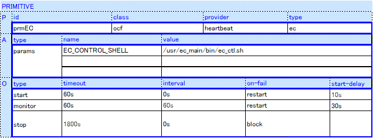 
Figure 3-5 Primitive resource (id=prmEC)

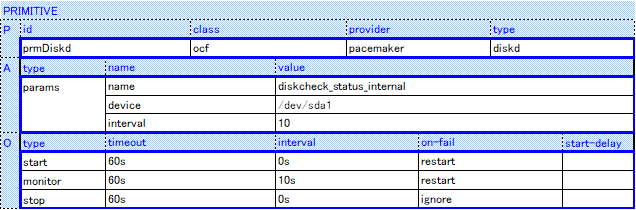 
Figure 3-6 Primitive resource (id=prmDiskd)

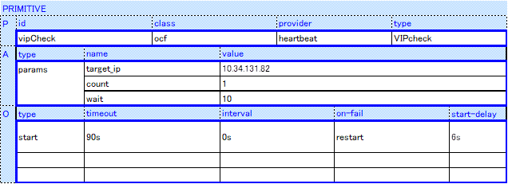 
Figure 3-7 Primitive resource (id=vipCheck)

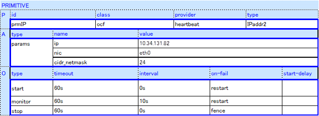 
Figure 3-8 Primitive resource (id=prmIP)

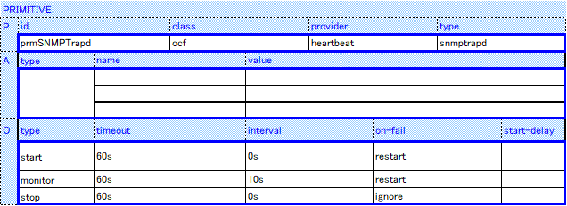 
Figure 3-9 Primitive resource (id=prmSNMPTrapd)

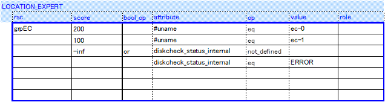 
Figure 3-10 Resource location restriction

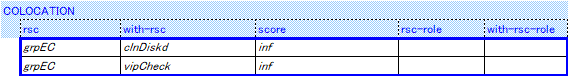 
Figure 3-11 Resource colocation restriction

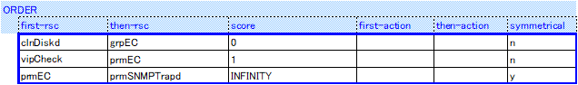 
Figure 3-12 Resource activation order restriction

#### 3.2.3.3. Injection of crm File

**&lt;Execution Host: ACT&gt;**

With the following commend, register the resource agent.

**\[crm configure load update \$EC\_HOME/conf/crm\_conf.crm\] \[Enter\]**

If the injection completes successfully, nothing will be displayed in
the screen. So you need to check the result by following the next
instruction. (\*Although a message which says the configured number of
seconds for VIPcheck is shorter than the default, you can ignore it and
keep on going.)

If there is any critical error in the configuration, a warning with the
location of the error will be displayed and you will be prompted to
answer with Y/N whether you want to keep the injection going or not.
When this warning is displayed, there must be errors in the
configuration, and you should answer it by entering \[N\] \[Enter\].

3.3. Confirm Setting
------------------

### 3.3.1. Confirmation of firewall configuration

Confirm the current configuration by executing the following command
(especially for the highlighted section).

**\[firewall-cmd \--list-all\] \[Enter\]**

**&lt;Execution Host: ACT/SBY/DB&gt;**

public (default, active)

interfaces:

sources:

services: dhcpv6-client `high-availability` `http` `ntp` ssh `tftp`

ports: `514/tcp` `162/udp` `514/udp` `18080/tcp`

masquerade: no

forward-ports:

icmp-blocks:

rich rules:

**&lt;Execution Host: DB&gt;**

public (default, active)

interfaces:

sources:

services: ssh

ports: `5432/tcp`

masquerade: no

forward-ports:

icmp-blocks:

rich rules:

### 3.3.2. Confirmation of Chrony behavior

**&lt;Execution Host: ACT/SBY&gt;**

Execute the following command to confirm the synchronization with the
NTP server.

**\[chronyc sources\] \[Enter\]**

&lt;The output example of successful synchronization&gt;

| MS Name/IP address  Stratum  Poll  Reach  LastRx  Last sample                                |
| -------------------------------------------------------------------------------------------- |
| \^\*   xxx.xxx.xxx.xxx         6     6   377     50    -1897ns\[-2575ns\] \+/\-   11ms       |

### 3.3.3. Confirmation of DHCP installation

**&lt;Execution Host: ACT/SBY&gt;**

Execute the following command to show the installed rpms and their versions.

**\[rpm -qa | grep -e dhcp-4.2.5\] \[Enter\]**

If the installation has been completed successfully, the following message in the list will be displayed.

> dhcp-4.2.5-42.el7.centos.x86_64

### 3.3.4. Confirmation of pacemaker operation

#### 3.3.4.1. Confirmation of Installation of Pacemaker

**&lt;Execution Host: ACT/SBY&gt;**

Execute the following command to confirm the version of Corosync.

**\[corosync -version\] \[Enter\]**

If the installation has been completed successfully, the following
message will be displayed.

> Corosync Cluster Engine, version \'2.3.5\'
>
> Copyright (c) 2006-2009 Red Hat, Inc.

Execute the following command to confirm the version of Pacemaker.

**\[crmadmin \--version\] \[Enter\]**

If the installation has been completed successfully, the following
message will be displayed.

> Pacemaker 1.1.14-1.el7
>
> Written by Andrew Beekhof

Execute the following command to confirm the version of crm.

**\[crm \--version\] \[Enter\]**

If the installation has been completed successfully, the following
message will be displayed.

> 2.1.5-1.el7 (Build unknown)

Execute the following command to confirm the resource agent which is
going to be used is actually installed.

**\[ls /lib/ocf/resource.d/pacemaker/\] \[Enter\]**

If the installation has been completed successfully, the following
message will be displayed.

> diskd

Execute the following command to confirm the resource agent which is
going to be used is actually installed.

**\[ls /lib/ocf/resource.d/heartbeat/\] \[Enter\]**

If the installation has been completed successfully, the following
message will be displayed.

> VIPcheck、IPaddr2

Confirm the configuration of the hosts

**\[ping "Stand-by Host Name"\] \[Enter\]**

> PING "Stand-by Host Name" (IP address for the stand-by
> interconnection) 56(84) bytes of data.
>
> 64 bytes from "Stand-by Host Name" (IP address for the stand-by
> interconnection): icmp\_seq=1 ttl=64 time=0.166 ms

**\[ping "Active Host Name"\] \[Enter\]**

> PING "Active Host Name" (IP address for the active interconnection)
> 56(84) bytes of data.
>
> 64 bytes from "Active Host Name" (IP address for the active
> interconnection): icmp\_seq=1 ttl=64 time=0.166 ms

In case the IP address and the Host Name are not displayed like this,
review the configuration at /etc/hosts.

#### 3.3.4.2. Confirmation of the Inter-node Communication Status

**&lt;Execution Host: ACT/SBY&gt;**

Execute the following command to confirm the status of inter-node
communication by use of \"corosync-cfgtool -s\" command.

This task must be performed both at the active and the stand-by nodes.

**\[corosync-cfgtool -s\] \[Enter\]**

If the cluster is started successfully, the following message will be
displayed in the screen.

When the \"status\" is \"active\" and \"no faults\", the communication
is working properly.

> Printing ring status.
>
> Local node ID (1 or 2)
>
> RING ID 0
>
> id = (IP address of the Active or Stand-by system)
>
> status = ring 0 active with no faults

#### 3.3.4.3. Confirmation of the Result of Injection

**&lt;Execution Host\: ACT or SBY&gt;**

Confirm the operational status of resource agent with the following
command.

**\[crm\_mon -fA -1\] \[Enter\]**

If it injected successfully, a message will be displayed as follows.

> Last updated: WDW MMM DD HH:MM:SS YYYY Last change: WDW MMM DD
> HH:MM:SS YYYY by root via cibadmin on (Active Node Name or Stand-by
> Node Name)
>
> Stack: corosync
>
> Current DC: (Active Node Name or Stand-by Node Name) (version
> 1.1.14-1.el7-70404b0) - partition with quorum
>
> 2 nodes and 5 resources configured
>
> Online: \[(Active Node Name) (Stand-by Node Name)\]
>
> Resource Group: grpEC
>
> vipCheck (VIPcheck): Started (Active Node Name))
>
> prmIP (IPaddr2): Started (Active Node Name)
>
> prmEC (ec): Started (Active Node Name)
>
> prmSNMPTrapd (snmptrapd): Started (Active Node Name)
>
> Clone Set: clnDiskd \[prmDiskd\]
>
> Started: \[(Active Node Name) (Stand-by Node Name)\]
>
> Node Attribute:
>
> \* Node (Active Node Name)
>
> \+ diskcheck\_status\_internal : normal
>
> \* Node (Stand-by Node Name)
>
> \+ diskcheck\_status\_internal : normal
>
> Migration Summary:
>
> \* Node (Active Node Name)
>
> \* Node (Stand-by Node Name)
> Summary:
>
> \* Node (Active Node Name)
>
> \* Node (Stand-by Node Name)

### 3.3.5. Confirmation of sysstat(sar) installation

**&lt;Execution Host: ACT/SBY&gt;**

Execute the following command to show the installed rpms and their versions.

**\[rpm -qa | grep -e sysstat\] \[Enter\]**

If the installation has been completed successfully, the following message in the list will be displayed.

> sysstat-11.6.0-1.x86_64

### 3.3.6. Confirmation of expect installation

**&lt;Execution Host: ACT/SBY&gt;**

Execute the following command to show the installed rpms and their versions.

**\[rpm -qa | grep -e expect -e tcl-8.5.13\] \[Enter\]**

If the installation has been completed successfully, the following message in the list will be displayed.

> tcl-8.5.13-8.el7.x86_64
>
> expect-5.45-14.el7_1.x86_64

### 3.3.7. Confirmation of bc installation

**&lt;Execution Host: ACT/SBY&gt;**

Execute the following command to show the installed rpms and their versions.

**\[rpm -qa | grep -e bc-1.06\] \[Enter\]**

If the installation has been completed successfully, the following message in the list will be displayed.

> bc-1.06.95-13.el7.x86_64
