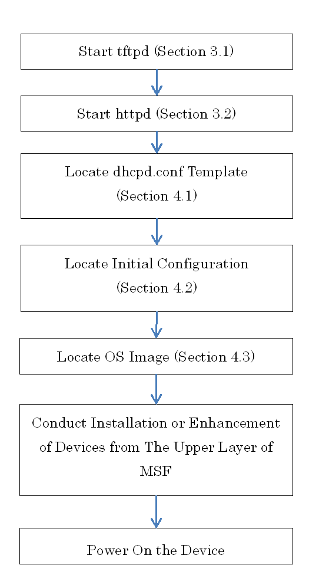

# Element Controller User Guide for ZTP

**Version 1.0**
**December 26, 2017**
**Copyright(c) 2017 Nippon Telegraph and Telephone Corporation**

## 1.  Introduction

This document describes how to operate ZTP in device installation or
enhancement, which is conducted with Element Controller (EC).

ZTP (Zero Touch Provisioning) is a general term for the functions which
will be triggered by resetting or powering-on of a device to
automatically perform the collection/set-up of the configuration or OS
installation of the device itself.

In this document, it is preconditioned that EC had been already
installed in accordance with the instructions described in `element_controller_installation_manual`
(hereafter referred to as `Installation Manual`).

Besides, the command operations should be performed as the root user
unless otherwise specified.

1.1. Expressional Conventions
------------------------

The legends of command input are described below.

\# COMMAND parameter <parameter> [parameter] Enter

\# ：the prompt sign

COMMAND ：a command name

parameter ：a regular parameter

\<parameter\> ：a parameter to be replaced (Change the content as
required.)

\[parameter\] ：a parameter that can be omitted

Enter ：pressing the Enter key

## 2. ZTP Operational Flow

The Figure 2-1 below illustrates the ZTP operational flow at the EC
server.

The detail of each operation follows from the next section.

## 3. Confirmation of Process Startup

Sequences and file acquisition processes are different each time
depending on the used device, and tftpd and httpd are used.

(It is presumed that tftpd and httpd have been already installed and
launched in accordance with the Installation Manual.)

3.1. tftpd
-----

### 3.1.1. Confirmation of tftpd Running

Confirm if tftpd is funning by use of the following command.

It should be noted that tftpd is started via xinetd.

\# systemctl status xinetd.serviceEnter

In case the output result shows \"active (running)", the process is
running.

| \[Output Result Process IS Running\]     |
|------------------------------------------|
| \--  Active: active (running)   \--                                      |

| \[Output Result Process is NOT Running\]  |
|------------------------------------------|
| \--  Active: inactive (dead)  \--                                       |

In case the process is not running, launch it with the following command. Execute the command and confirm that no error message is to be shown.

\# systemctl start xinetd.serviceEnter

### 3.1.2. Confirmation of Port Release for tftpd

Confirm with the following command that the port \#69 of UDP is released.

\# ss -lnu | grep :69Enter

Showing result reveals that the port is released.

In case the result is not shown, confirm the configuration of xinetd.

  \[Output Result\] 
  \------------------------ 
  UNCONN 0 0 \*:69 \*:\*

3.2. httpd
-----

### 3.2.1. Confirmation of httpd Running

Confirm if httpd is funning by use of the following command.

\# systemctl status httpd.serviceEnter

In case the output result shows \"active (running)", the process is
running.

| \[Output Result Process IS Running\]     |
|------------------------------------------|
| \--  Active: active (running)   \--                                      |

| \[Output Result Process is NOT Running\]  |
|------------------------------------------|
| \--  Active: inactive (dead)  \--                                       |

In case the process is not running, launch it with the following command. Confirm that no error message is to be shown.

\# systemctl start httpd.serviceEnter

### 3.2.2. Confirmation of Port Release for httpd

Confirm with the following command that the port \#80 of TCP is
released.

\# ss -lnt | grep :80Enter

Showing result reveals that the port is released.

In case the result is not shown, confirm the configuration of httpd.

  \[Output Result\] 
  \-------------------------- 
  LISTEN 0 128 \*:80 \*:\*

## 4. Locate the Configuration File

4.1. Locate the dhcpd.conf Template
------------------------------

The dhcpd.conf template files are different each time depending on the
used device.

Locate the dhcpd.conf template file corresponding to the type of device
to be enhanced into the file path configured at the time of registering
the device information. Please refer to the attached document for an
actual example of the template file. The following table illustrates the
list of attached document.

  |\[dhcp.conf Template Files\] List of Attached Documents  ||
  |---------------------------------------------------------|-------------------------------
  |File Name                                                | Overview
  |dhcpd.conf.qfx5100                                       | Juniper QFX5100 Template File
  |dhcpd.conf.qfx5200                                       | Juniper QFX5200 Template File
  |dhcpd.conf.ncs5001                                       | Cisco NCS5001 Template File
  |dhcpd.conf.ncs5011                                       | Cisco NCS5011 Template File
  |dhcpd.conf.ncs5501                                       | CISCONCS5501 Template File

4.2. Locate the Initial Configuration
--------------------------------

The initial configurations are different each time depending on the
usage and type of the used device.

Locate the initial configuration corresponding to the type and usage of
device to be enhanced into the file path configured at the time of
registering the device information.

### 4.2.1. Legends of the file's section to be modified

The following table shows the legends of modified sections in the
initial configuration. Modify the highlighted part as required.

| \[Initial Configuration\] (Juniper)        ||
|-----------------------------------|-----------------------------------|
| 1                                 | syslog {  host \[EC Server Address\] {  source-address \[Address for administration\];  any info;  \--                               |
| 2                                 | ntp {  server \[NTP Server Address\];  source-address \[Address for administration\];  }                                 |
| 3                                 | interfaces {  vme {  unit 0 {  family inet {                     |
|                                   | address \[Address/Prefix foradministration\];      |
|                                   | }  }  }                                |
| 4                                 | snmp { |
|                                   | community dhcp-provisioning-only  {  authorization read-only;  }                                 |
|                                   | community ntt-msf {  authorization read-only;  }               |
|                                   | trap-options {  source-address \[Address for administration\];  }      |
|                                   | trap-group ntt-msf {  version v2;  targets {  \[EC Server Address\];  }   }                                 |
|                                   | trap-group rmon-trap-group {  version v2;  categories {  rmon-alarm;  }      |
|                                   | targets {  \[EC Server Address\];  }                                 |
|                                   | }  \--                                 |

| \[Initial Configuration\] (Cisco) ||
|-----------------------------------|-----------------------------------|
| 5                                 | logging \[EC Server Address\] vrf default severity info port default |
| 6                                 | snmp-server host \[EC Server Address\] traps version 2c dhcp     |
| 7                                 | snmp-server host \[EC Server Address\] traps version 2c ntt-msf    |
| 8                                 | ntp server \[NTP Server Address\] |
| 9                                 | interface MgmtEth0/RP0/CPU0/0  ipv4 address \[Address for administration\] \[Subnet mask\]     |

### 4.2.2. Example of Sections in the File To Be Modified

The following tables show actual examples of sections to be modified.
Please refer to the attached document for more details.

It should be noted that the attached document provides just a part of
whole examples since the initial configuration may vary depending on the
role of switches as well as the type of devices.

| \[Initial Configuration\] (Juniper)     ||||
|-----------------|-----------------|-----------------|-----------------|
| File Name       | Section to be Modified (line \#)   | Change Description         | Legend \#       |
| ztp.conf.qfx5100-24q\_Spine | 23              | Enter the EC server address    | 1               |
|                 | 25              | Enter the address for administration       | 1               |
|                 | 54              | Enter the NTP server address    | 2               |
|                 | 55              | Enter the address for administration       | 2               |
|                 | 75              | Enter the address/prefix for administration.       | 3               |
|                 | 88              | Enter the address for administration       | 4               |
|                 | 93, 102         | Enter the EC server address    | 4               |
| ztp.conf.qfx5100-48s\_L2Leaf | 23              | Enter the EC server address    | 1               |
|                 | 25              | Enter the address for administration       | 1               |
|                 | 54              | Enter the NTP server address    | 2               |
|                 | 55              | Enter the address for administration       | 2               |
|                 | 73              | Enter the address/prefix for administration.       | 3               |
|                 | 86              | Enter the address for administration       | 4               |
|                 | 91, 100         | Enter the EC server address    | 4               |
| ztp.conf.qfx5100-48s\_L3Leaf | 23              | Enter the EC server address    | 1               |
|                 | 25              | Enter the address for administratione       | 1               |
|                 | 54              | Enter the NTP server address    | 2               |
|                 | 55              | Enter the address for administration       | 2               |
|                 | 75              | Enter the address/prefix for administration.       | 3               |
|                 | 88              | Enter the address for administration       | 4               |
|                 | 93, 102         | Enter the EC server address    | 4               |
| ztp.conf.qfx5200-32c\_Spine | 23              | Enter the EC server address    | 1               |
|                 | 25              | Enter the address for administration       | 1               |
|                 | 54              | Enter the NTP server address    | 2               |
|                 | 55              | Enter the address for administration       | 2               |
|                 | 75              | Enter the address/prefix for administration.e       | 3               |
|                 | 88              | Enter the address for administration       | 4               |
|                 | 93, 102         | Enter the EC server address    | 4               |
| ztp.conf.qfx5200-32c\_L3Leaf | 23              | Enter the EC server address    | 1               |
|                 | 25              | Enter the address for administration       | 1               |
|                 | 54              | Enter the NTP server address    | 2               |
|                 | 55              | Enter the address for administration       | 2               |
|                 | 75              | Enter the address/prefix for administration.       | 3               |
|                 | 88              | Enter the address for administration       | 4               |
|                 | 93, 102         | Enter the EC server address    | 4               |

| \[Initial Configuration\] (Cisco)     ||||
|-----------------|-----------------|-----------------|-----------------|
| File Name       | Section to be Modified (line \#)   | Change Description         | Legend \#       |
| ztp.script.ncs5001_L3Leaf | 17              | Enter the EC server address    | 5               |
|                 | 36              | Enter the EC server address    | 6               |
|                 | 37              | Enter the EC server address    | 7               |
|                 | 70              | Enter the NTP server address    | 8               |
|                 | 249             | Enter the address for administration.       | 9               |
|                 | 249             | Enter the subnet mask for administration address.       | 9               |
| ztp.script.ncs5011\_Spine | 17              | Enter the EC server address    | 5               |
|                 | 36              | Enter the EC server address    | 6               |             |
|                 | 37              | Enter the EC server address    | 7               |
|                 | 70              | Enter the NTP server address    | 8               |
|                 | 213             | Enter the address for administration.       | 9               |
|                 | 213             | Enter the subnet mask for administration address.       | 9               |
| ztp.script.ncs5501\_L3Leaf | 17              | Enter the EC server address    | 5               |             |
|                 | 36              | Enter the EC server address    | 6               |
|                 | 37              | Enter the EC server address    | 7               |
|                 | 70              | Enter the NTP server address    | 8               |
|                 | 109             | Enter the address for administration.      | 9               |
|                 | 109             | Enter the subnet mask for administration address.       | 9               |

4.3. Locate the OS Image
-------------------

This operation is only required if the type of enhanced device is
QFX5200.

Locate the OS image in the file path specified in the dhcpd.conf
template. Please refer to the following figure.

| \[dhcpd.conf Template\]                                               |
|-----------------------------------------------------------------------|
| \--  \#\#\#\#\#\#\#\#\#\#  \# host  \#\#\#\#\#\#\#\#\#\#     |
| \#\# QFX5200 \#\#  host QFX5200-1 {                                                      |
|   hardware ethernet \$\$MACADDRESS\$\$;    fixed-address \$\$MANAGEMENTADDRESS\$\$;    next-server \$\$TFTPHOSTNAME\$\$;    option tftp-server-name \"\$\$TFTPHOSTNAME\$\$\";                      |
| option QFX.alt-image-file-name  **\"/junos-conf/jinstall-qfx-5e-flex-15.1X53-D30.5-domestic-signed.tgz\"**; |
| option QFX.transfer-mode \"http\";  option QFX.config-file-name \"\$\$INITIALCONFIG\$\$\";  }                                                                     |
| dhcpd.conf.qfx5200 (END)  \--                                                                   |

(\*) **The file path (relative path) of the OS image.**

> Since the QFX5200's acquisition process is httpd, the absolute path
> here should be:
>
> /var/www/html/junos-conf/jinstall-qfx-5e-flex-15.1X53-D30.5-domestic-signed.tgz
