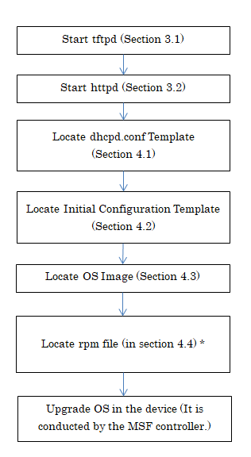

# Element Controller User Guide for ZTP

**Version 1.0**
** March 26, 2019 **
** Copyright(c) 2019 Nippon Telegraph and Telephone Corporation**

## 1.  Introduction

This document describes how to operate ZTP in device 
addition, which is conducted with Element Controller (EC).

ZTP (Zero Touch Provisioning) is a general term for the functions which
will be triggered by resetting or powering-on of a device to
automatically perform the collection/set-up of the configuration or OS
installation of the device itself. This document describes the operations optimized for the MSF controller by using the scripts and so on, in the various venders’ devices applicable to the MSF controller.
The ZTP operations which are not described in this document is not guaranteed in the MSF controller.

In this document, it is preconditioned that EC had been already
installed in accordance with the instructions described in `element_controller_installation_manual`
(hereafter referred to as `Installation Manual`).

Besides, the command operations should be performed as the root user
unless otherwise specified.

1.1. Expressional Conventions
------------------------

The legends of command input are described below.

\# COMMAND parameter \<parameter\> \[parameter\]

\# ：the prompt sign  
(The prompt signs are often different depending on the server or the device which is logged in. In this case, it should be replaced properly.)

COMMAND ：a command name

parameter ：a regular parameter

\<parameter\> ：a parameter to be replaced (Change the content as
required.)

\[parameter\] ：a parameter that can be omitted

## 2. ZTP Operational Flow

The Figure 2-1 below illustrates the ZTP operational flow at adding device controlled by the EC server.
* It is required to prepare the OS-image files used in the following procedures.

Figure 2-2 below illustrates the ZTP operational flow when the OS in the device is upgraded in the EC Server.
* Curently, the types of device in which OS can be upgraded are Cumulus (Leaf)、QFX5100、QFX5110、NCS5011 and NCS5501.
* It is required to prepare the OS-image files and rpm files used in the following procedure.

\* This operation is required only when OS in the Cisco (NCS5501, NCS5001) device is upgraded.

The detail of each operation follows from the next section.

## 3. Confirmation of Process Startup

Sequences and file acquisition processes are different each time
depending on the used device, and tftpd and httpd are used.
(It is presumed that tftpd and httpd have been already installed and
launched in accordance with the Installation Manual.) 
In addition, it is not required to check if both of tftpd and httpd are activated; however,
it is only required to confirm activation of the process which is applicable for the type of device to perform ZTP.

The process used in the type of each device are shown below.

  |Model name                                    | Name of the process             |
  |----------------------------------------------|---------------------------------|
  |QFX5100                                       | httpd                           |
  |QFX5110                                       | httpd                           |
  |QFX5200                                       | httpd                           |
  |NCS5001                                       | httpd                           |
  |NCS5501                                       | httpd                           |
  |NCS5011                                       | httpd (\+tftp : In case of OS Upgrade.)   |
  |Cumulus                                       | tftpd                           |

3.1. tftpd
-----

### 3.1.1. Confirmation of tftpd Running

Confirm if tftpd is funning by use of the following command.

It should be noted that tftpd is started via xinetd.

\# systemctl status xinetd.service

In case the output result shows \"active (running)", the process is
running.

| \[Output Result Process IS Running\]     |
|------------------------------------------|
| \--  Active: active (running)   \--                                      |

| \[Output Result Process is NOT Running\]  |
|------------------------------------------|
| \--  Active: inactive (dead)  \--                                       |

In case the process is not running, launch it with the following command. Execute the command and confirm that no error message is to be shown.

\# systemctl start xinetd.service

### 3.1.2. Confirmation of Port Release for tftpd

Confirm with the following command that the port \#69 of UDP is released.

\# ss -lnu | grep :69

Showing result reveals that the port is released.

In case the result is not shown, confirm the configuration of xinetd.

|  \[Output Result\]|
|------------------------|
|  UNCONN 0 0 \*:69 \*:\*|

3.2. httpd
-----

### 3.2.1. Confirmation of httpd Running

Confirm if httpd is funning by use of the following command.

\# systemctl status httpd.service

In case the output result shows \"active (running)", the process is
running.

| \[Output Result Process IS Running\]     |
|------------------------------------------|
| \--  Active: active (running)   \--                                      |

| \[Output Result Process is NOT Running\]  |
|------------------------------------------|
| \--  Active: inactive (dead)  \--                                       |

In case the process is not running, launch it with the following command. Confirm that no error message is to be shown.

\# systemctl start httpd.service

### 3.2.2. Confirmation of Port Release for httpd

Confirm with the following command that the port \#80 of TCP is
released.

\# ss -lnt | grep :80

Showing result reveals that the port is released.

In case the result is not shown, confirm the configuration of httpd.

|  \[Output Result\] |
|--------------------------|
|  LISTEN 0 128 \*:80 \*:\*|

## 4. Locate the Configuration File

4.1. Locate the dhcpd.conf Template
------------------------------
### 4.1.1. List of reserved words in file

The following table illustrates the list of reserved words to be converted in the dhcpd. conf template file.
(The reserved words are variables to replace different parameters depending on the environment. The MSF controller automatically replaces these words. Due to this, the user does not need to replace them.)

  | No.|reserved words                       |converted value
  |----|-------------------------------------|-----------------------|
  | 1  |\$\$HOSTNAME\$\$                     |Device Host Name|
  | 2  |\$\$MACADDRESS\$\$                   |Device MAC Address|
  | 3  |\$\$TFTPHOSTNAME\$\$                 |EC Management IF|
  | 4  |\$\$NTPSERVER\$\$                    |NTP Server Address|
  | 5  |\$\$INITIALCONFIG\$\$                |Device Initial Injection Configuration File Path|
  | 6  |\$\$MANAGEMENTADDRESS\$\$            |Device Management IF|
  | 7  |\$\$LOGSERVERADDRESS\$\$             |EC Management IF|
  | 8  |\$\$MANAGEMENTSUBNETMASK\$\$         |Subnet Mask of the network where the Device Management IF belongs to|
  | 9  |\$\$MANAGEMENTNETWORKADDRESS\$\$     |Address of the network where the Device Management IF belongs to|
  | 10 |\$\$MANAGEMENTRANGESTART\$\$         |The starting value of the address range which is available for the network where the Device Management IF belongs to|
  | 11 |\$\$MANAGEMENTRANGEEND\$\$           |The ending value of the address range which is available for the network where the Device Management IF belongs to|

### 4.1.2. Locate the dhcpd.conf Template

The dhcpd.conf template files are different each time depending on the used device.
In addition, in QFX5100, the dhcpd.conf template file used at adding device is different from that used when OS is upgraded in the device. 
Locate the dhcpd.conf template file corresponding to the type of device to be added into the file path configured at the time of registering the device information to MSF controller both when the device is added and when OS is upgraded in the device\*\.
Please refer to the attached document for an actual example of the template file.
The following table illustrates the list of attached document. 
*) Please make sure to be consistent with the parameters shown in the manual below. 
Manual: https://github.com/multi-service-fabric/fabric-controller/blob/master/API/controller_api.xlsx  
Parameter: 010101 sheet [dhcp_template]

  |\[dhcp.conf Template Files\] List of Attached Documents  | | |
  |---------------------------------------------------------|-|-------------------------------|
  |File Name/Directory                                      |File Name | Overview|
  |dhcpd.conf.qfx5100                                       | | Juniper QFX5100 Template File|
  |dhcpd.conf.qfx5110                                       | | Juniper QFX5110 Template File|
  |dhcpd.conf.qfx5200                                       | | Juniper QFX5200 Template File|
  |dhcpd.conf.ncs5001                                       | | Cisco NCS5001 Template File|
  |dhcpd.conf.ncs5011                                       | | Cisco NCS5011 Template File|
  |dhcpd.conf.ncs5501                                       | | Cisco NCS5501 Template File|
  |dhcpd.conf.cumulus                                       | | CUMULUS Template File|
  |dhcp_template_upgrade/                                   | | Folder for locating template used when OS is upgraded in the device.|
  |                                       |dhcpd.conf.qfx5100 | Juniper QFX5100 Template File (OS upgrade)|

4.2. Initial Configuration Template
--------------------------------

### 4.2.1. List of reserved words in file

The following table illustrates the list of reserved words to be converted in the initial configuration template file.
(The reserved words are variables to replace different parameters depending on the environment. The MSF controller automatically replaces these words. Due to this, the user does not need to replace them.)

  | No.|reserved words                       |converted value
  |----|-------------------------------------|-----------------------|
  | 1  |\$\$DEVICEMANAGEMENTADDRESS\$\$      |Device Management Address|
  | 2  |\$\$NTPSERVER\$\$                    |NTP Server Address|
  | 3  |\$\$SUBNETMASK\$\$                   |Device Subnet Mask|
  | 4  |\$\$DEVICEMANAGEMENT_CIDRADDRESS\$\$ |Maximum Number of Prefixes of the Device|
  | 5  |\$\$ECMANAGEMENTADDRESS\$\$          |Management IF of EC  (element_controller_configuration_specifications.md: **REST Waiting Interface Address**)|
  | 6  |\$\$COMMUNITYMEMBERS\$\$             |BGP Community Value|
  | 7  |\$\$BELONGINGSIDEMEMBERS\$\$         |BGP Community Value both priority and not priority|

### 4.2.2. Locate the Initial Configuration Template

The initial configuration templates are different each time depending on the usage and type of the used device. 
* In case of NCS5011 and NCS5501, the initial configuraion template at adding device are different from that when the OS is upgraded in the device.
* In case of Cumulus, the two diffrent ztp.sh are requred because the used templates for ztp.sh are different as to whether the added device is applicable to QinQ or non-QinQ.

Locate the initial configuration template files corresponding to the type and usage of device to be added into the file path configured at the time of registering the device information to MSF controller\*. 
Please refer to the attached document for an actual example of the template file. The following table illustrates the list of attached document and each used reserved words. 
In addition, device of some models requires a specific directory structure (hereinafter, referred to as ‘ZTP directory’) including files such as multiple initial configuration templates, etc.
In the applicable models, ZTP directory is required to be located in such a way that the initial configuration templates (bold letters shown in the table below) in the ZTP directory will be located directly under path configured at the time of registering the model. 
Please specify the directory to the applicable parameter\* when registering the device information to MSF controller.
Taking No.10 as an example, please link each file location using a separated value “:”, and then specify as follows:

・・・【Any path】・・・/cumulus_L2Leaf_ztp /cumulus/ztp_sh_template:・・・【Any
path】・・・/cumulus_L2Leaf_ztp/cumulus/EL3/config/config_template」）

In addition, you need to put the ZTP directory as shown in the table below.

*) Please make sure to be consistent with the parameters shown in the manual below. 
Manual: https://github.com/multi-service-fabric/fabric-controller/blob/master/API/controller_api.xlsx  
Parameter: 010101 sheet [config_template]

### 4.2.3. Example of Sections in the File To Be Modified

The following table illustrates the example of the correction part of the file
that needs modification in the initial configuration template.

|   |\[Initial Configuration Template\] (For Juniper, Spine)     |File Number of target |
|---|-------------------------------------------------------------------------|-----------------|
| 1 |policy-options {     prefix-list EL_Prefix {         **\[First Opposite L2Leaf Management Address\]/\[Prefix\],**         **\[Second Opposite L2Leaf Management Address\]/\[Prefix\]**     }  (\*)Make the list of the number of opposite L2Leafs. | 3,6 |

4.3. Locate the OS Image
-------------------

This operation is only required　only in the following cases.
* Add Device of QFX5200, QFX5110 or Cumulus
* Upgradation of device OS

Locate the OS image in the file path specified in the dhcpd.conf
template. Please refer to the following figure.

| \[QFX5200 dhcpd.conf Template\]                                       |
|-----------------------------------------------------------------------|
| \--  \#\#\#\#\#\#\#\#\#\#  \# host  \#\#\#\#\#\#\#\#\#\#     |
| \#\# QFX5200 \#\#  host QFX5200-1 {|
|   hardware ethernet \$\$MACADDRESS\$\$;    fixed-address \$\$MANAGEMENTADDRESS\$\$;    next-server \$\$TFTPHOSTNAME\$\$;   option tftp-server-name \"\$\$TFTPHOSTNAME\$\$\";                      |
| option QFX.alt-image-file-name  **\"/junos-conf/jinstall-qfx-5e-flex-15.1X53-D30.5-domestic-signed.tgz\"**; |
| option QFX.transfer-mode \"http\";  option QFX.config-file-name \"\$\$INITIALCONFIG\$\$\";  }                                                                     |
| dhcpd.conf.qfx5200 (END)  \--                                                                   |

(\*) **The file path (relative path) of the OS image.**

> Since the QFX5200's acquisition process is httpd, the absolute path
> here should be:
>
> /var/www/html/junos-conf/jinstall-qfx-5e-flex-15.1X53-D30.5-domestic-signed.tgz

| \[Cumulus dhcpd.conf Template\]|
|-----------------------------------------------------------------------|
| option cumulus-provision-url code 239 = text;   subnet $$MANAGEMENTNETWORKADDRESS$$ netmask $$MANAGEMENTSUBNETMASK$$ {  &nbsp;&nbsp;&nbsp;&nbsp;default-lease-time 600;   &nbsp;&nbsp;&nbsp;&nbsp;deny unknown-clients;   &nbsp;&nbsp;&nbsp;&nbsp;max-lease-time 7200;   &nbsp;&nbsp;&nbsp;&nbsp;range $$MANAGEMENTRANGESTART$$ $$MANAGEMENTRANGEEND$$;   &nbsp;&nbsp;&nbsp;&nbsp;option default-url = "tftp://**\$$TFTPHOSTNAME$$/cumulus/OS/cumulus-linux-3.6.0-bcm-amd64.bin\"**;   &nbsp;&nbsp;&nbsp;&nbsp;option cumulus-provision-url "tftp://$$TFTPHOSTNAME$$/cumulus/ztp.sh";   &nbsp;&nbsp;&nbsp;&nbsp;host $$HOSTNAME$$ {   &nbsp;&nbsp;&nbsp;&nbsp;&nbsp;&nbsp;&nbsp;&nbsp;hardware ethernet $$MACADDRESS$$;   &nbsp;&nbsp;&nbsp;&nbsp;&nbsp;&nbsp;&nbsp;&nbsp;fixed-address $$MANAGEMENTADDRESS$$;   &nbsp;&nbsp;&nbsp;&nbsp;&nbsp;&nbsp;&nbsp;&nbsp;option host-name "$$HOSTNAME$$";   &nbsp;&nbsp;&nbsp;&nbsp;}   }

(\*) **The file path (relative path) of the OS image.**

> Since the Cumulus's acquisition process is tftpd, the absolute path here should be:
> /var/lib/tftpd/cumulus/OS/cumulus-linux-3.6.0-bcm-amd64.bin

| \[QFX5110 dhcpd.conf Template\]                                       |
|-----------------------------------------------------------------------|
| \--  \#\#\#\#\#\#\#\#\#\#  \# host  \#\#\#\#\#\#\#\#\#\#     |
| \#\# QFX5110 \#\#  host QFX5110 {|
|   hardware ethernet \$\$MACADDRESS\$\$;    fixed-address \$\$MANAGEMENTADDRESS\$\$;    next-server \$\$TFTPHOSTNAME\$\$;   option tftp-server-name \"\$\$TFTPHOSTNAME\$\$\";                      |
| option QFX.transfer-mode \"http\"; |
| option QFX.alt-image-file-name  **\"/junos-conf/jinstall-host-qfx-5e-flex-x86-64-18.2R1.9-secure-signed.tgz"**;  option QFX.config-file-name \"\$\$INITIALCONFIG\$\$\";  }                                                                     |
| dhcpd.conf.qfx5110 (END)  \--                                                                   |

(\*) **The file path (relative path) of the OS image.**

> Since the QFX5110's acquisition process is httpd, the absolute path
> here should be:
>
> /var/www/html/junos-conf/jinstall-host-qfx-5e-flex-x86-64-18.2R1.9-secure-signed.tgz

| \[QFX5100 dhcpd.conf Template (OS Upgrade)\]                          |
|-----------------------------------------------------------------------|
| \--  \#\#\#\#\#\#\#\#\#\#  \# host  \#\#\#\#\#\#\#\#\#\#     |
| \#\# QFX5100 \#\#  host QFX5100 {|
|   hardware ethernet \$\$MACADDRESS\$\$;    fixed-address \$\$MANAGEMENTADDRESS\$\$;    next-server \$\$TFTPHOSTNAME\$\$;   option tftp-server-name \"\$\$TFTPHOSTNAME\$\$\";                      |
|  option QFX.transfer-mode \"http\";|
| option QFX.alt-image-file-name  **\"/junos-conf/jinstall-qfx-5-flex-14.1X53-D46.7-domestic-signed.tgz"**;   option QFX.config-file-name \"\$\$INITIALCONFIG\$\$\";  }                                                                     |
| dhcpd.conf.qfx5100 (END)  \--                                                                   |

(\*) **The file path (relative path) of the OS image.**

> Since the QFX5100's acquisition process is httpd, the absolute path
> here should be:
>
> /var/www/html/junos-conf/jinstall-qfx-5-flex-14.1X53-D46.7-domestic-signed.tgz

| \[NCS5011 dhcpd.conf Template (OS Upgrade)\]                          |
|-----------------------------------------------------------------------|
| \--  \#\#\#\#\#\#\#\#\#\#  \# host  \#\#\#\#\#\#\#\#\#\#     |
| \#\# NCS5011 \#\#  host NCS5011 {|
|   hardware ethernet \$\$MACADDRESS\$\$;    fixed-address \$\$MANAGEMENTADDRESS\$\$;    next-server \$\$TFTPHOSTNAME\$\$;   option tftp-server-name \"\$\$TFTPHOSTNAME\$\$\";                      |
| if exists user-class and option user-class = "iPXE" {  filename **\"http://$$TFTPHOSTNAME$$/ncs5k-iso/ncs5k-mini-x.iso-6.1.2"**; |
| } else {  filename "http://$$TFTPHOSTNAME$$$$INITIALCONFIG$$";  }  }                                                                     |

(\*) **The file path (relative path) of the OS image.**

> Since the NCS5011's acquisition process is httpd, the absolute path
> here should be:
>
> /var/www/html/ncs5k-iso/ncs5k-mini-x.iso-6.1.2

| \[NCS5501 dhcpd.conf Template (OS Upgrade)\]                          |
|-----------------------------------------------------------------------|
| \--  \#\#\#\#\#\#\#\#\#\#  \# host  \#\#\#\#\#\#\#\#\#\#     |
| \#\# NCS5501 \#\#  host NCS5501 {|
|   hardware ethernet \$\$MACADDRESS\$\$;    fixed-address \$\$MANAGEMENTADDRESS\$\$;    next-server \$\$TFTPHOSTNAME\$\$;   option tftp-server-name \"\$\$TFTPHOSTNAME\$\$\";                      |
| if exists user-class and option user-class = "iPXE" {  filename **\"http://$$TFTPHOSTNAME$$/ncs5k-iso/ncs5500-mini-x-6.3.2.iso"**; |
| } else {  filename "http://$$TFTPHOSTNAME$$$$INITIALCONFIG$$";  }  }                                                                     |

(\*) **The file path (relative path) of the OS image.**

> Since the NCS5501's acquisition process is httpd, the absolute path
> here should be:
>
> /var/www/html/ncs5k-iso/ncs5500-mini-x-6.3.2.iso

4.4. Locate the rpm files
-------------------

This operation is required only when OS is upgraded in the Cisco device.
Locate the rpm files on the file path described in the initial configuration template in order to upgrade OS in the device. See below.

| \[ncs5011_Spine_0.8_ztp_init.sh.template (OS Upgrade)\]               |
|-----------------------------------------------------------------------|
| \--  \#\#\#\#\#\#\#\#\#\#  \# Packages                       |
| ISIS_RPM=ncs5k-isis-1.1.0.0-r612.x86_64.rpm                           |
| K9SEC_RPM=ncs5k-k9sec-2.2.0.0-r612.x86_64.rpm                         |
| MCAST_RPM=ncs5k-mcast-2.0.0.0-r612.x86_64.rpm                         |
| MGBL_RPM=ncs5k-mgbl-3.0.0.0-r612.x86_64.rpm                           |
| MPLS_RPM=ncs5k-mpls-2.2.0.0-r612.x86_64.rpm                           |
| OSPF_RPM=ncs5k-ospf-1.0.0.0-r612.x86_64.rpm                           |
| echo \"\" \| xrcmd \"copy **tftp://$$ECMANAGEMENTADDRESS$$/ncs5k-rpm/5011_6.1.2/$MCAST_RPM** harddisk:\"|
| echo \"\" \| xrcmd \"copy **tftp://$$ECMANAGEMENTADDRESS$$/ncs5k-rpm/5011_6.1.2/$MPLS_RPM** harddisk:\" |
| echo \"\" \| xrcmd \"copy **tftp://$$ECMANAGEMENTADDRESS$$/ncs5k-rpm/5011_6.1.2/$MGBL_RPM** harddisk:\" |
| echo \"\" \| xrcmd \"copy **tftp://$$ECMANAGEMENTADDRESS$$/ncs5k-rpm/5011_6.1.2/$OSPF_RPM** harddisk:\" |
| echo \"\" \| xrcmd \"copy **tftp://$$ECMANAGEMENTADDRESS$$/ncs5k-rpm/5011_6.1.2/$ISIS_RPM** harddisk:\" |
| echo \"\" \| xrcmd \"copy **tftp://$$ECMANAGEMENTADDRESS$$/ncs5k-rpm/5011_6.1.2/$K9SEC_RPM** harddisk:\"|

(\*) **The file path (relative path) of the rpm file.**

> Taking ncs5k-mcast-2.0.0.0-r612.x86_64.rpm as an example,
> since NCS 5011 's acquisition process is “tftpd” and the file name is “$MCAST_RPM”,
> the absolute path here should be:
>
> \"/var/lib/tftpd/ncs5k-rpm/5011_6.1.2/ncs5k-mcast-2.0.0.0-r612.x86_64.rpm\"

| \[ncs5501_ILeaf_0.8_ztp_init.sh.template (OS Upgrade)\]               |
|-----------------------------------------------------------------------|
| \--  \#\#\#\#\#\#\#\#\#\#  \# Packages                       |
| ISIS_RPM=ncs5500-isis-1.3.0.0-r632.x86_64.rpm                         |
| K9SEC_RPM=ncs5500-k9sec-4.1.0.0-r632.x86_64.rpm                       |
| LI_RPM=ncs5500-li-1.0.0.0-r632.x86_64.rpm                             |
| MCAST_RPM=ncs5500-mcast-2.1.0.0-r632.x86_64.rpm                       |
| MGBL_RPM=ncs5500-mgbl-4.0.0.0-r632.x86_64.rpm                         |
| MPLS_RPM=ncs5500-mpls-2.1.0.0-r632.x86_64.rpm                         |
| MPLSTE_RPM=ncs5500-mpls-te-rsvp-2.2.0.0-r632.x86_64.rpm               |
| OSPF_RPM=ncs5500-ospf-2.0.0.0-r632.x86_64.rpm                         |
| echo \"\" \| xrcmd \"copy **http://$$ECMANAGEMENTADDRESS$$/ncs5k-rpm/5501_6.3.2/$MCAST_RPM** harddisk:\"|
| echo \"\" \| xrcmd \"copy **http://$$ECMANAGEMENTADDRESS$$/ncs5k-rpm/5501_6.3.2/$MPLS_RPM** harddisk:\" |
| echo \"\" \| xrcmd \"copy **http://$$ECMANAGEMENTADDRESS$$/ncs5k-rpm/5501_6.3.2/$MGBL_RPM** harddisk:\" |
| echo \"\" \| xrcmd \"copy **http://$$ECMANAGEMENTADDRESS$$/ncs5k-rpm/5501_6.3.2/$MPLSTE_RPM** harddisk:\" |
| echo \"\" \| xrcmd \"copy **http://$$ECMANAGEMENTADDRESS$$/ncs5k-rpm/5501_6.3.2/$OSPF_RPM** harddisk:\" |
| echo \"\" \| xrcmd \"copy **http://$$ECMANAGEMENTADDRESS$$/ncs5k-rpm/5501_6.3.2/$ISIS_RPM** harddisk:\" |
| echo \"\" \| xrcmd \"copy **http://$$ECMANAGEMENTADDRESS$$/ncs5k-rpm/5501_6.3.2/$LI_RPM** harddisk:\" |
| echo \"\" \| xrcmd \"copy **http://$$ECMANAGEMENTADDRESS$$/ncs5k-rpm/5501_6.3.2/$K9SEC_RPM** harddisk:\"|

(\*) **The file path (relative path) of the rpm file.**

> Taking ncs5500-mcast-2.1.0.0-r632.x86_64.rpm as an example,
> since NCS 5501 's acquisition process is “httpd” and the file name is “$MCAST_RPM”,
> the absolute path here should be:
>
> \"/var/www/html/ncs5k-rpm/5501_6.3.2/ncs5500-mcast-2.1.0.0-r632.x86_64.rpm\"

## 5. Operation of Device

This operation is required in the only case of adding device.
The manual operation is not required because it is automatically performed by the scripts when OS upgradation.

Method for starting-up of ZTP is different depending upon the vendor of device. Operation method is described below.
Once this procedure has been done, all configurations, etc, will be deleted automatically.
Therefore, please make sure to create a backup of them in advance, and save them in another server.

---
### 5.1. Operational Procedures for JUNIPER’s Device

The following procedure is required, if the target devices is not QFX5110. 
If remote access via ssh is possible, use the following command to activte ZTP.

\# request system zeroize

Enter Yes, when asked a Yes/No question. 
Confirm if ssh disconnects naturally.

When remote access is unavaiable, peform the above procedure from a console.

In case where the target device is QFX5110, perform the following procedure.

\# configure

After entering the configuration edit mode, enter the following command.

\# load factory-default 
\# set system services ssh 
\# set system services netconf ssh 
\# set system root-authentication encrypted-password \\\$1\\\$osUf/onb\$HbE0.Do5tmDp3ywLVnRdM/ 
\# set system login user nslab uid 2000 
\# set system login user nslab class super-user 
\# set system login user nslab authentication encrypted-password \\\$1\\\$zCVxLjUU\\\$5QWFBU/IIoT7G/M0ooEld. 
\# set interfaces vme unit 0 family inet dhcp vendor-id Juniper-qfx5110-48s-4c 
\# commit 
\# exit 

Exit the configuration edit mode and enter the following command.

\# request system reboot at now

Enter Yes, when asked a Yes/No question. 
Confirm if ssh disconnects naturally.

### 5.2. Operational Procedures for CISCO’s Device

Before a reset, it is required to complete the following procedure by performing remote accss via ssh.

\# ztp clean 
\# configure

Enter the following command, when it changes to the Configuration Edit Mode.

\# commit replace

Enter Yes, when asked a Yes/No question. 
Ensure that no response will be returned from the command prompt.

Power cable needs to be detached/inserted (a power switch is not provided) because CISCO’s device cannot be reset remotely.

### 5.3. Operational Procedures for Cumulus

Initialize the device by using the following command.

\# sudo onie-select -k

Enter Yes, when asked a Yes/No question. 
Confirm that the follwowing is shown.
If it is not shown, initialize the device again because the answer (yes/no) has an error.

> Enabling ONIE uninstall mode at next reboot...done. 
> Reboot required to take effect.

After initialization has been finished, restart the device by using the following command.

\# sudo shutdown -r now
